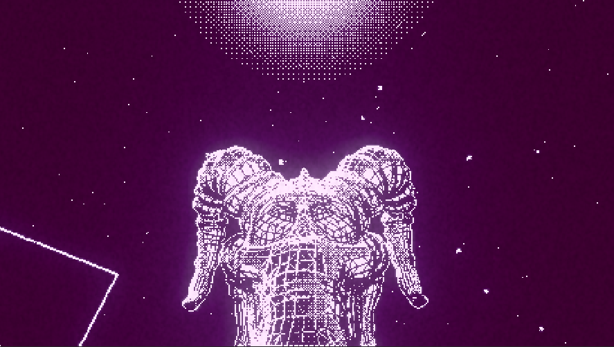
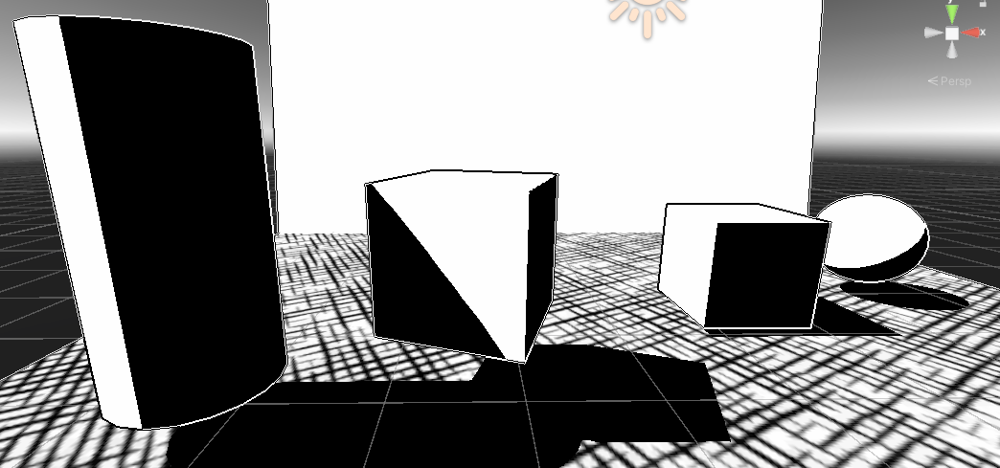
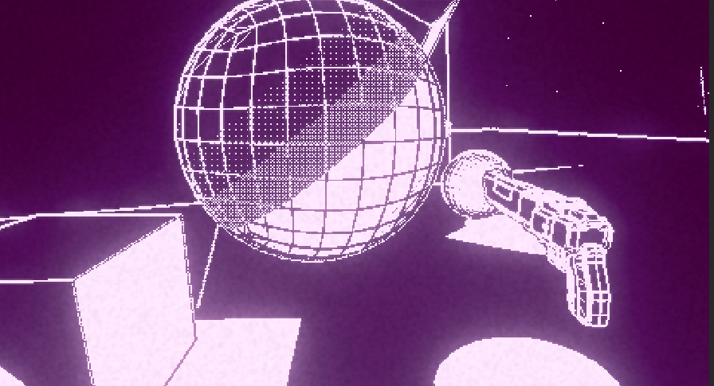
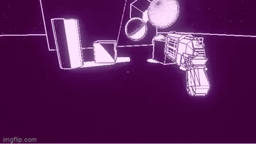

# Twin-Darkness
   

 
An arena shooter with horror elements inspired by demon daggers. Still a work in progress but I'm gaining ground.

## Visuals
  The main components of the visuals of the game are the custom lighting and the outline image shader. Afterwards, postprocessing and dithering give it the final look.
  ### Custom Lighting
     
    The custom lighting pass is inspired by Lucas Pope's work on Obra Dinn. A material is used to calculate the light and shadows using Lambert. It's then packaged with 
    the texture info and passed as rgb values to the image shader.
    
  ### Outline
   
    The outline pass uses the light and texture to determine the color of the outline. Outlines are calculated using a convolution on the depth buffer to detect edges.

## Movement
  The movement uses a port of quake's movement to Unity. I'm thinking of switching to cinemachine for camera controlls to add more flair. 
  
## Combat Loop
 
  The combat revolves around your two shot revolver. With each shot, the bullet changes element from light to dark and dark to light. My intent is to have enemies
  for both elements. Bullets of the same type heal them while the opposite element damages. The main game loop would involve making fast target switches. My aim is to
  implement a score system (and combo multiplier) so that missing a shot makes you lose your combo.
